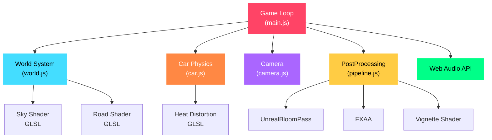

<p align="center">
  
</p>

<p align="center">
  
  
  
  
  
  
</p>

<p align="center">
  
  
  
  
  
</p>

<br/>

<div align="center">

> *A production-grade, cinematic browser driving experience — Roblox geometry meets Unreal Engine lighting.*
> 
> **No frameworks. No build tools. Pure Three.js + Custom GLSL.**

</div>

<br/>

---

<h2 align="center">🌆 Experience</h2>

<table align="center">
<tr>
<td align="center" width="50%">

### 🎬 Cinematic Start Screen
Animated gradient title with glassmorphism<br/>controls overlay and pulsing call-to-action

</td>
<td align="center" width="50%">

### 🏙️ Open World City
120+ procedural buildings with lit windows,<br/>neon signs, traffic signals, and floating particles

</td>
</tr>
<tr>
<td align="center">

### 🚗 Physics-Based Driving
Acceleration, friction, drift mechanics,<br/>suspension bounce, and exhaust particles

</td>
<td align="center">

### 🎥 Cinematic Camera
Smooth lerp follow, speed-based FOV zoom,<br/>camera shake, and roll tilt on turns

</td>
</tr>
</table>

---

<h2 align="center">✨ Feature Highlights</h2>

<div align="center">

|  | Feature | Details |
|:---:|:---|:---|
| 🎨 | **3 Custom GLSL Shaders** | Animated sky dome with stars & clouds, wet reflective road, exhaust heat distortion |
| 🌃 | **Procedural City** | Low-poly buildings, glowing windows, neon signs, animated traffic signals |
| 🏎️ | **Car Physics Engine** | Velocity, acceleration, friction, drift with dust particles, brake lights |
| 🎥 | **Cinematic Camera** | Smooth follow, dynamic FOV, speed shake, turn tilt — feels filmic |
| 💡 | **Advanced Lighting** | ACESFilmic tone mapping, street lights, underbody neon glow, light beams |
| 🌸 | **PostProcessing Pipeline** | UnrealBloomPass, FXAA, custom vignette — all speed-reactive |
| 🔊 | **Web Audio Engine Sound** | Dual-oscillator synthesis with distortion & lowpass filter |
| 🖥️ | **Glassmorphism HUD** | Speedometer, gear indicator, dynamic glow — Apple-level polish |
| ✨ | **Ambient Particles** | 2000 floating dust motes with additive blending |
| 🌅 | **Animated Sky Dome** | Procedural sunset gradient, twinkling stars, drifting clouds |

</div>

---

<h2 align="center">🎮 Controls</h2>

<div align="center">

```
╔══════════════════════════════════════════╗
║                                          ║
║          [ W ] — Accelerate              ║
║          [ S ] — Brake / Reverse         ║
║          [ A ] — Steer Left              ║
║          [ D ] — Steer Right             ║
║        [SPACE] — Drift 🔥               ║
║                                          ║
╚══════════════════════════════════════════╝
```

</div>

---

<h2 align="center">📂 Project Architecture</h2>

```
🏎️ car-game-static/
├── 📄 index.html                    # Game shell + Three.js importmap + HUD
├── 🎨 styles.css                    # Glassmorphism HUD + cinematic overlay
├── 📂 js/
│   ├── 🎮 main.js                   # Game loop, renderer, audio, input, HUD
│   ├── 🌆 world.js                  # Procedural city, buildings, roads, lights
│   ├── 🚗 car.js                    # Car model, physics, particles, lights
│   ├── 🎥 camera.js                 # Cinematic follow camera system
│   ├── 📂 shaders/
│   │   ├── 🌌 skyShader.js          # Animated sky gradient + stars + clouds
│   │   ├── 🛤️ roadShader.js         # Wet reflective road with light streaks
│   │   └── 🔥 heatDistortion.js     # Exhaust heat shimmer effect
│   └── 📂 postprocessing/
│       └── 💫 pipeline.js           # Bloom + FXAA + Vignette composer
└── 📖 README.md
```

---

<h2 align="center">🚀 Quick Start</h2>

<div align="center">

```bash
# Clone the repo
git clone https://github.com/1sarthak7/car-game-static.git

# Navigate into it
cd car-game-static

# Serve locally (any static server works)
python3 -m http.server 8080

# Open in browser
open http://localhost:8080
```

</div>

> [!TIP]
> No `npm install`. No build step. Just serve and play. Works on **GitHub Pages** and **Netlify** out of the box.

---

<h2 align="center">🛠️ Tech Stack Deep Dive</h2>

<div align="center">



</div>

---

<h2 align="center">🎨 Rendering Pipeline</h2>

<div align="center">

| Stage | Technology | Effect |
|:---:|:---|:---|
| 1️⃣ | `ACESFilmicToneMapping` | Cinematic color reproduction |
| 2️⃣ | `PCFSoftShadowMap` | Soft real-time shadows |
| 3️⃣ | `FogExp2` | Atmospheric depth fog |
| 4️⃣ | `UnrealBloomPass` | Cinematic glow (speed-reactive) |
| 5️⃣ | `FXAA` | Edge anti-aliasing |
| 6️⃣ | `Custom Vignette` | Speed-reactive screen darkening |

</div>

---

<h2 align="center">🌟 What Makes This Different</h2>

<div align="center">

```diff
-  Basic cube car with static camera
+  Detailed car model with spoiler, cabin, and underbody neon glow

-  No lighting or flat shading
+  ACESFilmic tone mapping + soft shadows + street lights + bloom

-  No postprocessing
+  UnrealBloom + FXAA + speed-reactive vignette pipeline

-  No shaders
+  3 custom GLSL shaders (sky, road, heat distortion)

-  Tutorial-level code
+  Production-grade ES module architecture
```

</div>

---

<h2 align="center">📱 Browser Compatibility</h2>

<div align="center">

| Browser | Status |
|:---:|:---:|
| Chrome 90+ |  Full Support |
| Firefox 90+ |  Full Support |
| Safari 15+ |  Full Support |
| Edge 90+ | Full Support |
| Mobile Chrome | Touch controls not yet added |

</div>

---

<h2 align="center">🤝 Contributing</h2>

<div align="center">

Contributions are welcome! Feel free to open issues or submit PRs.

```
Fork → Branch → Code → PR → 🎉
```

</div>

---


<p align="center">
  
</p>

<p align="center">
  <a href="https://github.com/1sarthak7">
    
  </a>
</p>

<p align="center">
  <b>⭐ If you like this project, give it a star! ⭐</b>
</p>
